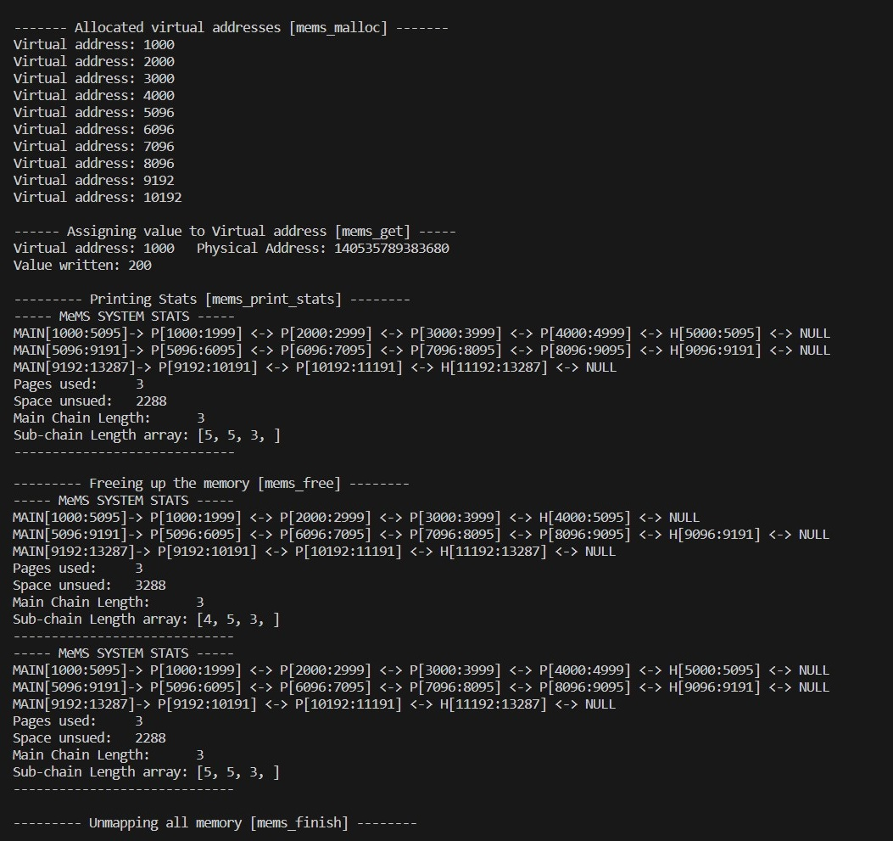

# MeMS: Memory Management System [CSE231 OS Assignment 3]
[Documentation](https://docs.google.com/document/d/1Gs9kC3187lLrinvK1SueTc8dHCJ0QP43eRlrCRlXiCY/edit?usp=sharing)
---

### How to run the example.c
After implementing functions in mems.h follow the below steps to run example.c file
```
$ make
$ ./example
```
---
### Format of mems_mems_print_stats
* For every Subchain in the free list print the data as follows 
```
MAIN[starting_mems_vitual_address:ending_mems_vitual_address] -> <HOLE or PROCESS>[starting_mems_vitual_address:ending_mems_vitual_address] <-> ..... <-> NULL
```
* After printing the whole freelist print the following stats
```
Page used: <Total Pages used by the user>
Space unused: <Total space mapped but not used by user>
Main Chain Length: <Length of the main chain>
Sub-chain Length array: <Array denoting the length of the subchains>
```
* Analyse the output of the example.c file below to get a better understanding of the output
---
### Example Output
PAGE_SIZE= 4096 Bytes

Starting MeMS Virtual Address= 1000



### Project Description
We have implemented a Memory Management System using C Programming Language. The Basic Working is as follows:

* There is a Main Chain List which points to a Sub-List of Memory Blocks holding Processes and Free Spaces in it. The Memory Allocated for every Main List Node is a Multiple of PAGE_SIZE. This has been implemented using a Doubly Linked List.

* Each Sub List Node can be a Process or a Hole: Process implies a Memory Block has a running Process, Hole implies Memory Block is Free.

* Whenever Memory for a new process is asked for, the Program checks through all the Free Spaces in the structure and if a Free Space with Memory Space enough for the process is found, the Free Space is divided into Process Space and a new Free Space (Remaining Space).

* If no such Sub List Node is found, a new Main List Node is created assigned with new Memory and contains a similar Sub-List.

* All memory allocations have been done using mmap() and munmap().

### Functions in mems.h
* void mems_init(): Initializes all the required parameters for the MeMS system.
Input Parameter: Nothing
Returns: Nothing

* void mems_finish(): Unmap the allocated memory using the munmap system call.
Input Parameter: Nothing
Returns: Nothing

* void* mems_malloc(size_t size): Allocates memory of the specified size by reusing a segment from the free list if a sufficiently large segment is available. Else, uses the mmap system call to allocate more memory on the heap and updates the free list accordingly.
Parameter: The size of the memory the user program wants
Returns: MeMS Virtual address (that is created by MeMS)

* void mems_free(void* ptr): Frees the memory pointed by ptr by marking the corresponding sub-chain node in the free list as HOLE. Once a sub-chain node is marked as HOLE, it becomes available for future allocations.
Parameter: MeMS Virtual address (that is created by MeMS)
Returns: nothing

* void mems_print_stats(): Prints the total number of mapped pages (using mmap) and the unused memory in bytes (the total size of holes in the free list). It also prints details about each node in the main chain and each segment (PROCESS or HOLE) in the sub-chain.
Parameter: Nothing
Returns: Nothing but should print the necessary information on STDOUT

* void *mems_get(void*v_ptr): Returns the MeMS physical address mapped to ptr ( ptr is MeMS virtual address).
Parameter: MeMS Virtual address (that is created by MeMS)
Returns: MeMS physical address mapped to the passed ptr (MeMS virtual address).
